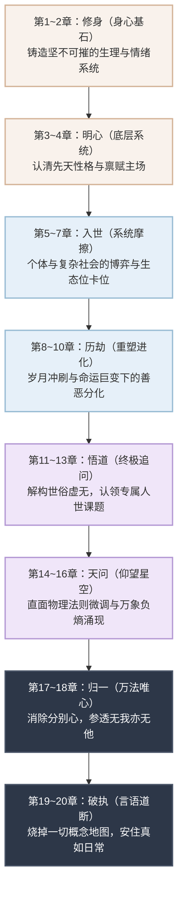

# 从身心安顿到生活实践：个体生存与探索的底层逻辑 (全书大纲与架构图)

## 全书核心逻辑架构

本书的50万字并非散文堆砌，而是遵循着一个人从“物理肉身”一路进化到“终极觉醒”的严密逻辑链条。在阅读具体章节前，请先宏观俯瞰这条“成事与成人的闭环路径”：

<BookRoadmap />

---

## 阶段一：身心基石 —— 铸造坚不可摧的身心系统（第1~2章）
*导语：身心不是我们用来压榨的工具，而是我们体验世界的唯一载体。*

### 第一章：身体健康（淬炼物理躯体）
**1. 生命的基础节律**
*   睡眠的科学与修复机制（节律、深度睡眠的意义）
*   饮食与能量代谢（我们摄入的物质如何塑造我们的情绪和精力）
*   现代生活方式对生物本能的剥夺与重建

**2. 东方修身之道：气血、经络与内求之法**
*   东方哲学的身体观：身体是一个微观宇宙，“骨正筋柔，气血以流”
*   **外练筋骨：八部金刚功的阳刚之美**
    *   金刚功的原理：引天之阳气，通五脏六腑，祛除体内病气
    *   动作背后的经络运行逻辑
*   **内养气血：八部长寿功的阴柔之养**
    *   长寿功的原理：纳地之阴气，濡养精血，培补元气
    *   动静结合：金刚功（外/阳/刚）与长寿功（内/阴/柔）的阴阳互补系统
*   中医视角下的“治未病”：顺应四时，节用精力

**3. 西方强身之术：解剖、量化与对抗突破**
*   西方科学的身体观：身体是一台可升级的精密机器
*   力量训练与抗阻（抵抗肌肉流失、骨质疏松与内分泌衰退）
*   心肺功能储备（Zone 2 基础有氧与 HIIT 爆发训练）
*   量化自我（Biohacking）：利用可穿戴设备与指标监控健康

**4. 东西方融合：构建属于你的身体修炼系统**
*   如何兼顾“张力（西方器械）”与“通达（东方功法）”？
*   早晨金刚功唤醒，傍晚长寿功收敛，穿插力量训练的实操模型。

### 第二章：心理与心灵健康（构建内在堡垒）
**1. 现代人的精神内耗**
*   信息超载、多巴胺劫持与注意力涣散
*   意义感缺失、比较焦虑与自我压榨的根源

**2. 东方心灵哲学：儒释道三家经典的心法解构**
*   **儒家：极度入世中的“诚意正心”与“中庸之道”**
    *   修齐治平的前提是“修身”：《大学》里的知止定静安虑得。
    *   “尽人事”：专注行动过程，建立世俗世界的心理定海神针。
*   **道家：无为而无不为的“臣服与流动”**
    *   《道德经》与《庄子》的智慧：反脆弱与消解功利心。
    *   顺应自然规律，放弃无意义的精神对抗，减少认知摩擦力。
*   **佛家：觉察本心与破除执念的“空性智慧”**
    *   《金刚经》“应无所住而生其心”与《心经》的观照（做情绪的旁观者）。
    *   正念（Mindfulness）：安住当下，斩断过去悔恨与未来担忧的锁链。
*   **三家合流：** 以儒做人（创造价值），以道做事（顺应变化），以佛修心（面对得失）。

**3. 西方心理学的干预工具**
*   认知行为疗法（CBT）与斯多葛学派（区分可控与不可控）
*   神经可塑性：如何通过刻意练习改变大脑的焦虑回路

---

## 阶段二：底层系统 —— 认知自我与挖掘禀赋（第3~4章）
*导语：在健康的躯体之上，认清自己出厂时的“硬件配置”和“底层代码”，是避免在错误赛道上徒劳无功的前提。*

### 第三章：性格底色与内在驱动力
**1. 性格的迷思：先天基因 vs 后天塑造**
*   接纳你的“出厂设置”：内向/外向、高敏感特质的重新定义

**2. 测量与定位：认识自我的工具箱**
*   利用心理学工具（MBTI等）与生命轨迹回溯法寻找性格原型
*   镜像反馈：在极端压力下暴露出的真实面貌

### 第四章：挖掘先天禀赋
**1. 什么是真正的“禀赋”？**
*   “对别人来说是工作，对你来说是玩耍”
*   你的注意力天然被什么吸引？

**2. 进入心流（Flow）的线索**
*   破除社会规训的干扰，找回被主流价值观掩盖的真实天赋

---

## 阶段三：碰撞映射 —— 个体禀赋在复杂世界中的投影（第5~7章）
*导语：个人的禀赋在真空里是毫无意义的。当带着特定性格设定的个体，一头扎进充斥着利益、人性、随机性与阶层壁垒的复杂人类社会时，剧烈的化学反应才刚刚开始。*

### 第五章：系统摩擦：当“内在自我”遭遇“外在丛林”
**1. 人类社会的复杂性图景**
*   社会的底层运转逻辑：权力动态、利益交换与丛林法则的文明化伪装
*   “社会时钟”与“标准人生模板”对独特个体的挤压
*   黑天鹅事件与随机性：运气在努力与天赋面前的绝对力量

**2. 性格特质在社会中的奖惩机制**
*   **顺应性红利**：某些性格（如高外向、高服从）为何在传统职场中更容易获得短期世俗奖赏？
*   **异类税（The Misfit Tax）**：高敏感、特立独行或极端专注的人，在找到适合生态位前，必须支付的痛苦代价。
*   社会的反馈延迟与误判：为什么真价值往往初期被漠视，而伪价值容易被追捧？

### 第六章：反身性冲击：外界反馈对身心与认知的重塑
**1. 对心理与认知的冲击（精神的淬炼或崩塌）**
*   **认知失调与自我怀疑**：当你的禀赋在市场上毫无定价时，如何抵抗虚无主义？
*   **面具的异化（Persona）**：为了生存而长期扮演非真实性格（如内向者强装社牛），导致的心灵枯竭与身份认同危机。
*   **被伤害后的两种突变**：变得愤世嫉俗（退缩防卫），或是进化出“认知灰度”（包容复杂与幽暗）。

**2. 对物理躯体的投射（躯体化反应）**
*   **病由心生**：长期在不契合自己性格的赛道上博弈，高压与委屈如何转化为结节、甲状腺问题或免疫系统崩溃。
*   **精力的掠夺**：在非心流状态下的社交与工作，如何像黑洞一样抽干原本通过“金刚功/长寿功”好不容易积攒的气血。

### 第七章：动态适应与进化：寻找你的生态位
**1. 认知觉醒：从“证明自己”到“运用自己”**
*   放弃与世界的硬碰硬，学会将自己的劣势转化为某种特定语境下的绝对优势。
*   在儒家的“知其不可而为之”与道家的“知其不可奈何而安之若命”之间找到动态平衡。

**2. 建立缓冲带（Buffer Zone）**
*   不要毫无保留地将最脆弱的底色暴露给世界。
*   构建你的“个人API”：用一套标准化的社会面具处理日常摩擦，将最核心的禀赋留给真正的价值创造。
*   寻觅同类与打造微环境：如果大环境排斥你，如何通过网络或小圈子建立滋养你的私域生态。

**3. 财富观与人际算法（以何种姿态入世）**
*   **搞钱的内功心法**：赚钱不是劫掠，而是自身真实价值的自然溢价。将财富视为“做对事情、帮到他人”后的必然副产品，而非过度执着的目的。
*   **人际交往的柔性哲学**：对周遭世界保持绝对的开放、包容与谦和心态。放下傲慢与防御，把每一个遇见的人都当作学习的对象。
*   **洞察并包容人性**：看透人性深处的幽暗、贪婪与脆弱，但不用来攻击，而是生出深深的理解与包容。以“上善若水”的心态去承载大家，在成全他人的过程中，自然顺畅地成就自己。

**4. 财富的流转与守卫（花钱与投资的修行）**
*   **花钱的智慧（用钞票为世界投票）**：赚到钱后，是沉溺短期感官的吃喝玩乐，还是投资自身（锻炼身体、精进技能、购买真正提升生命质量的工具）？你的消费结构，决定了你未来的生命质感。
*   **消费的价值观审视**：我们把钱付给谁，就是在支持什么样的世界。是选择追求极致产品体验、有底线的企业，还是华而不实重营销的品牌？是支持真正用心做品质与服务的企业（如胖东来），还是纵容劣币驱逐良币的伪劣产品？
*   **投资理财（认知的终极变现）**：财富的守卫是一门深奥的学问。A股与美股的底层逻辑差异、债券的避险属性、黄金白银与石油期货的周期波动。投资从来不是赌博，而是你对这个世界运行规律、地缘政治博弈以及宏观周期的深度认知，在金融市场上的知行合一。

---

## 阶段四：蜕变分化 —— 漫长岁月与人生巨变下的灵魂重塑（第8~10章）
*导语：真正考验人性的，不是微风荡漾的顺境，而是长达十年的岁月消磨，或是突如其来的命运暴击。在废墟之上，人会迎来最彻底的二次发育。*

### 第八章：时间的冲刷与命运的暴击
**1. 十年熔炉：渐进式的性格演化**
*   妥协还是圆融？时间如何打磨性格的锐角
*   温水煮青蛙与平庸之恶：在安逸与重复中，一个人如何不知不觉丧失最初的禀赋

**2. 剧变时刻（Crucible Moments）：瞬间击穿认知防御**
*   人生巨变（如破产、丧亲、背叛、重病，或骤然暴富/掌权）对心理底线的撕裂
*   旧地图失效：当原有的信念系统无法解释突发灾难时，引发的“存在主义危机”与心理失重

### 第九章：深渊的回望 —— 面对黑暗的十字路口
**1. 同途殊归的岔路**
*   为何同样经历了命运的毒打，有人凝视深渊最终化为恶龙，有人却生出极大的悲悯之心？

**2. 转向黑暗（黑化与防御机制）**
*   犬儒主义与马基雅维利主义的觉醒：不再相信规则，只相信利益与权力
*   防御性攻击：为了不再被伤害，选择主动成为规则的破坏者（把善良视为软弱的幻觉）

**3. 不改初心（历劫后的纯粹）**
*   真正的英雄主义：认清生活真相后依然热爱（罗曼·罗兰式重塑）
*   高级的善良：善良不再是一种未经世事的本能，而是一种“见识过幽暗，看透了算计，却依然选择坚守”的顶级能力与自由意志

### 第十章：向善与向恶的底层密码（溯源）
**1. 童年剧本与家庭烙印**
*   原生家庭教育如何埋下危机时的“应激代码”
*   安全感匮乏者 vs 拥有退路者：在绝境中做出选择的潜意识差异

**2. 人性的终极拷问：本性与底线**
*   剥开道德外衣后，人的动物性（绝对利己求生）与神性（利他与超越）的惨烈博弈
*   环境毒性阈值：好人变坏，究竟是本性使然，还是环境的恶劣程度超过了其道德承受的临界点？

**3. 精神防坠网的兜底**
*   在巨变来临时，前文提到的“儒释道”智慧如何发挥真正的威力：成为防止灵魂自由落体坠毁的安全网

---

## 阶段五：终极追问 —— 繁华落尽后的人生意义与课题（第11~13章）
*导语：当一个人完整体验了亲情聚散、商海沉浮，目睹了宏观周期的生灭后，对世俗成功的执念终将剥落。最终站在废墟或巅峰上的他，无可避免地要面对那三个终极问题。*

### 第十一章：巨流冲刷与意义的觉醒
**1. 外部世界的全景式震撼**
*   **微观的悲欢**：亲人间的生死别离、朋友/合伙人间的利益背叛与患难结盟。
*   **中观的博弈**：商业世界中你死我活的竞争、零和博弈与残酷的丛林法则。
*   **宏观的碾压**：不可抗的外部力量（如国家政策转向、技术革命摧毁行业、中美大国博弈的时代灰尘落在个人头上的重量）。

**2. 世俗巅峰的虚无危机**
*   当历经沧桑、甚至获取了世俗定义的成功（金钱、地位）后，为何依然会感到一种深不见底的灵魂空洞？
*   从“向外攫取”到“向内探寻”的转折点：不再焦灼于“如何赢下这场游戏”，而是开始追问“这场游戏为何而设”。

### 第十二章：认领你的人世课题
**1. 人生是一场特定的体验**
*   摒弃“人生是一场分数竞赛”的叙事。地球是一所学校，每个人投生于此，都有其特定要完成的“灵魂课题”（Life Lessons）。
*   如何识别自己的课题？（通常是你生命中反复出现、最让你痛苦的那一类困境，如学会放下控制欲、学会原谅、学会不带附加条件地爱）。

**2. 苦难意义的重构**
*   所有的挫折与巨变都不是惩罚，而是唤醒你完成特定课题的“催化剂”和“敲门砖”。
*   完成课题的标志：不再试图掌控不可控的事物，达到了绝对的内在自洽与深深的和解。

### 第十三章：三大究竟问题的现代证悟
**1. 我是谁？（身份的极致剥离）**
*   剥去你的社会头衔、银行存款、社会关系，甚至剥去这具会衰老的肉体，剩下的那个纯粹的“观察者”究竟是谁？
*   真我（Self）与假我（Ego）的彻底辨识：摆脱小我带来的恐惧与傲慢。

**2. 我从哪里来？（因果、血脉与宇宙坐标）**
*   生物学层面的基因记忆与文化层面的祖先烙印。
*   我们在浩瀚宇宙、地球生态圈与人类历史长河中的微观坐标与宏大联系（天人合一的现代理解）。

**3. 我要到哪里去？（超越死亡与有限性）**
*   **向死而生（Being-towards-death）**：直面并接纳死亡的必然性，死亡不是剥夺意义，而是赋予现世生命以紧迫感和终极意义。
*   **意识的永恒与传承**：既然肉体终将消亡，如何通过创造价值、思想传承以及施予纯粹的爱，跨越时间的边界，实现某种意义上的“不朽”。

---

## 阶段六：天问 —— 存在之源与宇宙的终极审视（第14~16章）
*导语：当向内对自我的剖析穷尽，向外对社会的探索止步，最后的最后，人类必然会仰望星空，发出一连串近乎疯狂的“为什么”。这是对存在本身的终极追问，是脱离了世俗肉身后的纯粹灵魂之问。*

### 第十四章：无中生有（存在之谜）
**1. 这个世界到底从何而生？**
*   大爆炸理论的物理边界：奇点之前的虚无，时空的起点在哪里？
*   “为什么是有，而不是无？”（Why is there something rather than nothing?）——莱布尼茨与海德格尔的终极哲学迷思。
*   创世论、多重宇宙与模拟假说：面对“第一因（First Cause）”时，人类理性的无力与敬畏。

### 第十五章：日月轮转与秩序的暴政
**1. 天体何以运行？**
*   为什么太阳会转？月亮会转？日月何以千万年轮转不息？
*   从牛顿的引力、爱因斯坦的相对论，到底层的量子规律：统治这一切运转的“最高律法”到底是谁书写的？
*   精细调节的宇宙（Fine-tuned Universe）：四大基本力为什么恰好被设定成了让生命得以存在的数值？只要差小数点后一百万位，我们就不复存在。

### 第十六章：不可思议的丰盛与多样
**1. 为什么会如此丰富多彩？**
*   **宏观宇宙的绚烂**：从暗物质的深邃到星云的璀璨，宇宙为什么不是灰暗枯燥的单一元素？
*   **微观人间的斑斓**：人世间为什么会有如此极致的善恶美丑、悲欢离合？为什么会有艺术、音乐和无用的美？
*   熵增定律（万物注定走向死寂的宿命）下的奇迹：在无情的衰败中，为何能绽放出高度复杂的生命之花？

**2. 终极的“WHY”：不可解的答案**
*   不可知论的谦卑：作为三维生物的大脑硬件，也许从物理限制上就永远无法理解宇宙的完整因果链。
*   **观察者的意义**：或许正是因为有了人类的“发问”，有了意识的存在，这个宇宙的丰富多彩才拥有了闭环。
*   最终的和解：放弃得到最终的答案。以极其短暂、渺小但又极其鲜活的生命，去纯粹地“见证”这不可思议的宇宙奇迹本身。

---

## 阶段七：归一 —— 无我亦无他，万法唯心造（第17~18章）
*导语：当宇宙的终极发问重重落下，激荡的回音最终会归于绝对的寂静。在最深邃的觉察中，人与人、人与宇宙的边界开始消融。最后你终会发现，那个发问的“我”，其实并不存在。*

### 第十七章：边界的消融（我即是他）
**1. 幻觉的帷幕**
*   为什么我们会觉得“我”和“他”是分开的？肉体与自我意识造成的物理与心理隔离错觉。
*   世间本无我，也无他。我可能就是他，他可能就是我。我们二人本质上并没有任何不同，是同一个宇宙源头伸出的不同触角。

**2. 万法的显化（心不相同）**
*   既然本质并无不同，为何世间会如此丰富多彩？
*   因为每个人的“心”不相同。我们带着不同的滤镜（认知、执念、习气）看向同一个世界，面对同一件事情，内心中会生出完全不同的看法、见解与反应。
*   这个世界的极度绚烂与参差多态，恰恰是源于这无数颗在迷局中体验不同剧本、投射出不同幻象的“心”。

### 第十八章：终极的解脱（连“我”也没有）
**1. 只有体验，没有体验者**
*   当看透了“他即是我”，便生出了绝对的同理与慈悲（因为伤害他就是伤害自己）。
*   当看透了“万法唯心造”，便切断了所有的烦恼之源。
*   最终的证悟：唯有“存在”本身。连那个在经历、在痛苦、在追问的“我”也不过是一场大梦中的幻相。

**2. 寂静的欢喜**
*   没有观察者，也没有被观察的世界，只有那一刻纯粹的“觉知”。
*   在这无边无际的空性与圆融中，一切的“为什么”都已经不再需要答案，因为你已经化为了答案本身。

---

## 阶段八：破执 —— 言语道断，文字的局限与不可说（第19~20章）
*导语：当你读到这里，请把你刚才看过的、思考过的这十万字全部忘掉。把我们之前建立的所有宏大叙事全部“破掉”。因为那个真正的终极境界，是人类的语言文字根本无力承载的。*

### 第十九章：指月之指与语言的牢笼
**1. 文字本身的降维与扭曲**
*   语言文字的局限性太大了：文字是线性的、逻辑的、二元对立的产物，它本身只是在这个物理世界中被发明出来的工具。
*   试图用文字去描述那个超越维度的终极境界，就像用网去捞水，用二维的画笔去画三维的微风。一旦开口，便落入俗套；一旦定义，便产生局限（“道可道，非常道”）。

**2. 玄之又玄，难以名状**
*   那个真正的“东西”（道、空性、本源），是说不尽、理不清、难以清楚描述的。
*   前面那十万字，仅仅是“指向月亮的手指”。如果读者执着于这手指（文字与道理），反而永远看不到那轮悬在空中的真月。

### 第二十章：以心传心，不立文字
**1. 越过语言的灵魂共振**
*   最高维度的东西是无法用语言表达的，它只能以“心”来传达，只能用两颗心来交流（以心印心，拈花微笑）。
*   当真正达到了那种境界，所有的声音都会归于绝对的静默。真正的交流，只发生在心领神会、相视一笑的沉默之中。

**2. 终极的放下**
*   合上这本十万字的书，不要再向外寻找任何理论，不要再向文字索要任何答案。
*   回到最平淡无奇的日常生活中去。去吃饭，去睡觉，去感受微风。用你那颗不再被语言束缚的心，去亲自体验那难以言说的一切。

---

*（全书结语：这是一场从淬炼躯体、认清自我，到闯荡丛林、历经巨变，再到参透死生与天问，最后打破自我边界的旅程。而在旅程的终点，作者亲手烧掉了这份耗尽心血写成的“地图”，在一片大雪无痕的留白中，与读者相视一笑，一切尽在不言中。）*
